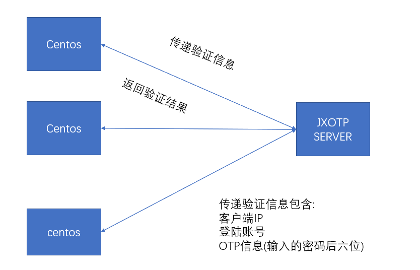
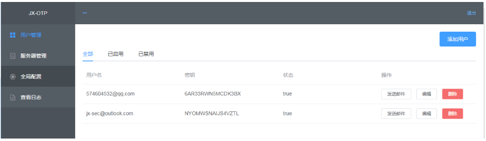
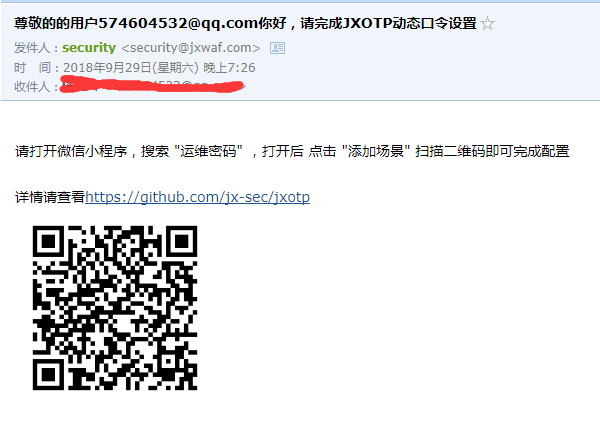
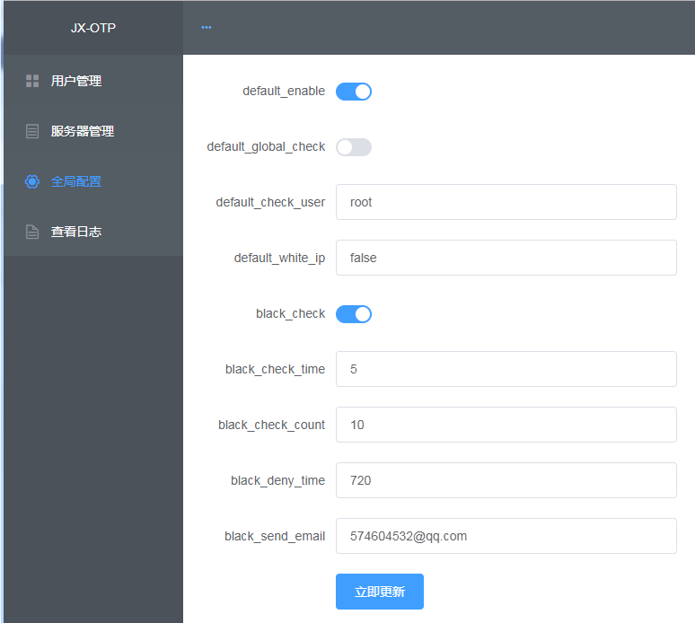
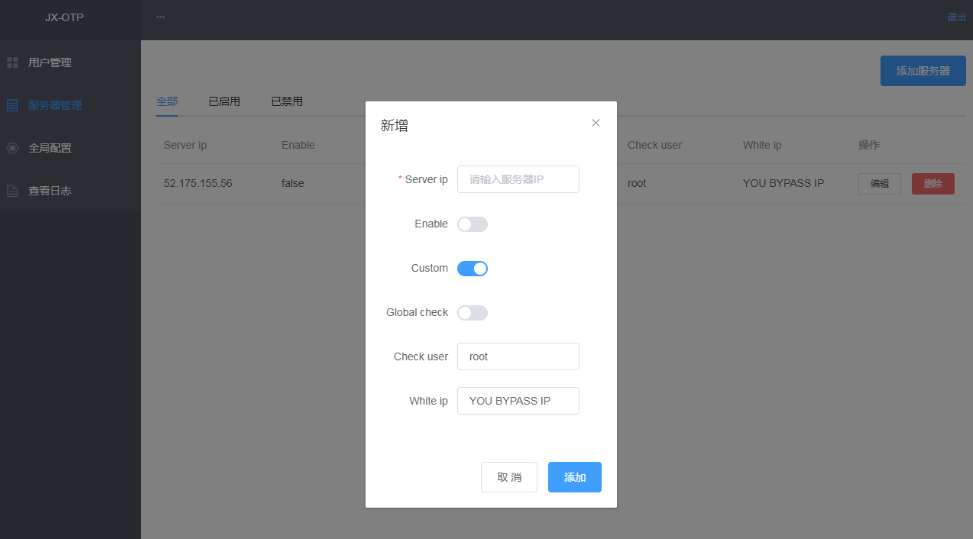
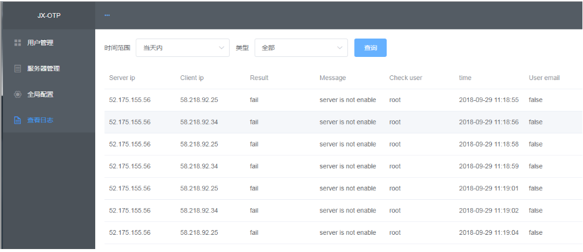

### 一 前言

这次发布的版本适合企业使用,兼容堡垒机,LDAP等.

目前只支持linux,等哪天有时间在完善windows

适用于云服务器等场景,部署及使用简单方便

同时可做为主机IDS的补充防护,主机IDS毕竟是事中事后防护,JXOTP可以做为事前防护提高服务器的整体安全性


### 二 部署

#### 服务端部署:


```
# git clone https://github.com/jx-sec/jxotp.git
# cd jxotp
# pip install -r requirements.txt
# vim jxotp/settings.py
```
直接拉到最下面

```
# 邮件设置 这里以阿里邮箱为例子
EMAIL_BACKEND = 'django.core.mail.backends.smtp.EmailBackend'
EMAIL_USE_TLS = False
EMAIL_HOST = 'smtp.mxhichina.com' #非阿里邮箱需修改
EMAIL_PORT = 25
EMAIL_HOST_USER = 'security@jxwaf.com' # 用户名
EMAIL_HOST_PASSWORD = '*' #密码
DEFAULT_FROM_EMAIL = 'security@jxwaf.com' #同用户名

# login setup
USERNAME = 'admin' # 服务端登陆用户名
PASSWORD = '123456' # 服务端登陆密码
OTP_SECRET_KEY = 'hellojxotp' # OTP客户端与服务端对接的密钥
```
接下来初使化数据库,启动服务端 PS:例子为非正式部署,需正式部署请使用uwsgi+nginx

```
# python manage.py makemigrations
# python manage.py migrate
# python manage.py runserver 0.0.0.0:8000
```
服务端部署结束

#### 客户端部署:

```
# vim jxotp_auth.py
```
只需修改两个参数的配置

SERVER_API_URL = "http://1.1.1.1:8000/otp_auth"

OTP_SECRET_KEY = "hellojxotp"

其中 SERVER_API_URL 为你部署服务器的地址,如你服务器地址为
52.163.121.204,则这块应设置为 http://52.163.121.204:8000/otp_auth

OTP_SECRET_KEY 为OTP客户端与服务端对接的密钥,需与服务端一致


```
# setenforce 0 
# sh install_jxotp.sh
# vim /etc/pam.d/sshd
```

在最顶行添加
```
auth optional pam_python.so jxotp_auth.py
```
到这里客户端和服务端就全部部署完了


### 三 架构及使用说明

#### 架构说明


- 一旦网络中断或者服务器异常,服务器的OTP验证将自动转为bypass模式,回归密码验证
- 默认服务端OTP验证为偏移3次,也即当前时间两分钟内的OTP验证码都有效,提高易用性
- 客户端OTP验证为独立验证,所以不与LDAP等验证冲突,验证失败会将密码重置为空,导致密码验证失败(服务器密码要是为空算你牛逼)
- 可通过配置服务器验证将堡垒机IP加入白名单,即兼容堡垒机
- 可开启防暴力破解功能,例如OTP验证错误超过10次,锁定客户端IP三十分钟,并邮件报警,可针对特定用户开启,也可设置特定IP开启,总之就是灵活,满足大部分应用场景

#### 使用说明

##### 1 用户管理


新建用户后点击发送邮件



#### 2 全局设置


default_enable  是否开启服务器自动注册

默认为true,当有客户端访问JXOTP SERVER时,自动注册,无需管理员手动添加

default_global_check 是否开启所有用户检测 

默认为false,当值为true时,所有登录的用户都需要进行OTP检验,为false时,仅设置了default_check_user的用户会开启OTP检验

default_check_user  默认值为root 

当default_global_check为true时生效(不要在意为啥false时不屏蔽该选项),设置需要开启OTP检验的系统用户名

default_white_ip 默认值为false

当需要设置白名单IP或者已使用堡垒机时,可将相应IP添加进去,中间用逗号(,)隔开,如白名单IP为1.1.1.1,堡垒机IP为2.2.2.2,则值为  1.1.1.1,2.2.2.2

black_check  默认值为false

是否开启防暴力破解功能,默认为false,关闭状态

black_check_time 默认值为5

暴力破解功能检测时间,单位为分钟,5即检测5分钟内暴力破解的攻击次数

black_check_count 默认值为 10

OTP失败次数,10即失败10次开启防暴力破解功能

black_deny_time  默认值为 720

检测到暴力破解攻击后封禁IP的时间,单位为分钟,720即封禁IP 12小时

black_send_email  默认值为  ?

检测到暴力破解攻击后告警邮箱

#### 3 服务器管理




自定义设置会覆盖全局配置,其他同全局配置,可手动添加需要开启OTP功能的服务器,也可在全局配置开启default_enable选项,即自动注册服务器

#### 4 查看日志



Server ip   服务器IP

Client ip   客户端IP 

Result     OTP校验结果

Message  详细信息

Check user  登录的系统用户名

time   登录校验的时间

User email  登录用户(OTP用户,非服务器系统用户)


### 三 总结

支线任务完结撒花

JXWAF恢复更新